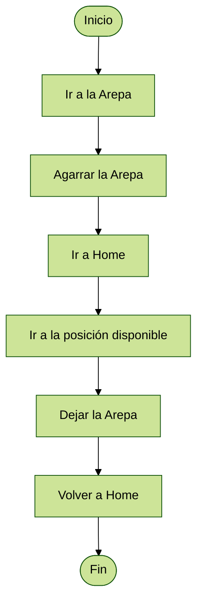

# Proyecto Final - Robótica Industrial: Automatización del Proceso de Preparación de Arepas
Jenny Ximena Ordoñez Espinosa

Juan Felipe Hincapie Gomez

Santiago Zamora Sosa

Stivens Camilo Guevara Moran

## Descripción de la solución planteada  <!--  el proceso de alistamiento, herramientas y piezas utilizadas -->

## Diagrama de Flujo  <!-- descripciones-->
En general, se muestra el planteamiento de la lógica del progrma, que al elegir una arepa la dirige a la posición disponible, considerando el orden (A1, A2, B1, B2). Tras un tiempo gira la arepa y tras otra cantidad de tiempo, retira la arepa de la parrilla.

## Subrutinas
Posicionamiento de la Arepa:

Para el posicionamiento de la arepa en el lugar deseado de la parrilla, el manipulador se dirige a la arepa, la sujeta, la mueve al lugar esperado y la suelta, iniciando un temporizador para el giro de la arepa.

Giro de la Arepa:
Cuando el temporizador supera un limite establecido, el manipulador se dirige a la arepa, la sujeta, realiza un giro en la ultima articulación, y deja la arepa en la posición inicial. Además inicia un temporizador que dara lugar a la subrutina de salida.

Salida de la Arepa:
Al superar el temporizador un tiempo determinado, el manipulador se dirige a la arepa, la sujeta, se dirige a la posición inicial de la arepa en toda la rutina y deja la arepa.

## Gripper Diseñado <!-- Descripción, planos y fotografías-->
Para el diseño del gripper, inicialmente se planteó el problema de colocar la arepa en una posición exacta al momento de voltearla, con el fin de facilitar su recogida una vez haya finalizado la cocción por ambos lados. Por esta razón, se diseñó un gripper que no presentara un ángulo con respecto al plano "NO" del efector final.

En un principio se consideró dejar una distancia entre el plano "NO" (NOA) del efector final y la cara inferior del gripper. Sin embargo, esto generaría nuevamente el mismo inconveniente: al girar la arepa sería necesario soltarla en el aire, lo cual implicaría una incertidumbre considerable sobre su posición final al caer.

Una vez se discutió y definió claramente el enfoque para el diseño del gripper, se procedió a seleccionar un actuador neumático de entre los disponibles en el laboratorio. Se eligió un actuador neumático de doble efecto con pinzas, debido a la facilidad de acople entre este y el gripper, además de que su movimiento se ajustaba perfectamente con los requerimientos del proyecto. Dicho actuador se muestra a continuación:

Posteriormente, se tomaron las medidas del actuador neumático para diseñar el respectivo acople entre este y las piezas del gripper. Además, se elaboró un modelo CAD del actuador con el objetivo de integrarlo con las piezas del gripper y generar un archivo .sat que permitiera su uso en simulaciones dentro del software RobotStudio.

Una vez se comprobó el correcto funcionamiento del conjunto gripper-actuador mediante simulaciones, se procedió a la impresión de cada una de las piezas y a su ensamblaje con el actuador neumático.

A continuación, se presentan algunas imágenes del gripper utilizado para el desarrolo del proyecto en el laboratorio, así como los planos correspondientes a cada una de sus piezas.

## Modelo en Software de Simulación <!-- predeterminado del entorno robótico con todos los elementos que intervienen en el proceso-->

## Comparación del tiempo de alistamiento manual y de operación automatizada para las combinaciones seleccionadas.

## Código implementado en RAPID.
MODULE Module1
        CONST robtarget Home:=[[695.900298248,0,627.140190345],[0.5,0,0.866025404,0],[0,0,0,0],[9E+09,9E+09,9E+09,9E+09,9E+09,9E+09]];
    CONST robtarget Target_20:=[[350,500,500],[0.454519478,-0.54167522,0.54167522,0.454519478],[0,1,-2,0],[9E+09,9E+09,9E+09,9E+09,9E+09,9E+09]];
    CONST robtarget Target_90:=[[583.455,106.18,396.738],[0.707106781,0,0.707106781,0],[0,-1,0,1],[9E+09,9E+09,9E+09,9E+09,9E+09,9E+09]];
    CONST robtarget Target_60:=[[500,500,400],[0.5,-0.5,0.5,0.5],[0,1,-2,0],[9E+09,9E+09,9E+09,9E+09,9E+09,9E+09]];
    CONST robtarget Target_120:=[[343.607795518,395.04650951,240.735483005],[0.607743917,0.509957696,-0.391304304,-0.46633831],[0,0,0,0],[9E+09,9E+09,9E+09,9E+09,9E+09,9E+09]];
    CONST robtarget Target_100:=[[583.179,-143.614,397.189],[0.382683433,0,0.923879532,0],[0,0,0,0],[9E+09,9E+09,9E+09,9E+09,9E+09,9E+09]];
    CONST robtarget Target_110:=[[733.048,-143.508,399.004],[0,0,1,0],[0,0,0,0],[9E+09,9E+09,9E+09,9E+09,9E+09,9E+09]];
    CONST robtarget Target_30:=[[500,500,500],[0.5,-0.5,0.5,0.5],[0,1,-2,0],[9E+09,9E+09,9E+09,9E+09,9E+09,9E+09]];
    CONST robtarget Target_140:=[[400,0,400],[0,0,1,0],[0,0,0,0],[9E+09,9E+09,9E+09,9E+09,9E+09,9E+09]];
    CONST robtarget Target_150:=[[0,0,0],[1,0,0,0],[0,0,0,0],[9E+09,9E+09,9E+09,9E+09,9E+09,9E+09]];
    CONST robtarget Target_170:=[[583.179,-143.614,397.189],[0.64278761,0,0.766044443,0],[-1,1,-2,0],[9E+09,9E+09,9E+09,9E+09,9E+09,9E+09]];
    CONST robtarget Target_180:=[[583.455,106.18,396.738],[0.64278761,0,0.766044443,0],[0,-2,1,0],[9E+09,9E+09,9E+09,9E+09,9E+09,9E+09]];
    CONST robtarget Target_40:=[[650,500,500],[0.484930441,-0.541159665,0.468797915,0.502212305],[0,1,-2,0],[9E+09,9E+09,9E+09,9E+09,9E+09,9E+09]];
    CONST robtarget Target_200:=[[134.256947897,470,159.064666217],[0.094815754,0.700721038,-0.700721038,-0.094815754],[0,-1,0,1],[9E+09,9E+09,9E+09,9E+09,9E+09,9E+09]];
    CONST robtarget Target_320:=[[434.212769611,470,187.328679343],[0,-0.707106781,0.707106781,0],[0,-1,0,1],[9E+09,9E+09,9E+09,9E+09,9E+09,9E+09]];
    CONST robtarget Target_310:=[[134.256947897,570,159.064666217],[0,0.9841771,0,-0.17718757],[0,0,0,0],[9E+09,9E+09,9E+09,9E+09,9E+09,9E+09]];
    CONST robtarget Target_230:=[[93.879795518,638.795762615,90.365483005],[0.707106781,0,0,-0.707106781],[-1,-1,0,1],[9E+09,9E+09,9E+09,9E+09,9E+09,9E+09]];
    CONST robtarget Target_220:=[[93.879795518,396.60150951,90.365483005],[0.707106781,0,0,-0.707106781],[-1,-1,0,1],[9E+09,9E+09,9E+09,9E+09,9E+09,9E+09]];
    CONST robtarget Target_250:=[[343.673795518,644.205530799,90.641483005],[0.59966056,0.374709505,-0.374709505,-0.59966056],[0,-1,1,0],[9E+09,9E+09,9E+09,9E+09,9E+09,9E+09]];
    CONST robtarget Target_270:=[[343.607795518,615.89822058,240.735483005],[0.627211375,0.326505576,-0.326505576,-0.627211375],[0,-2,1,0],[9E+09,9E+09,9E+09,9E+09,9E+09,9E+09]];
    CONST robtarget Target_290:=[[93.985795518,617.454916755,240.234483005],[0.637412263,-0.306113716,0.306113716,-0.637412263],[-1,-1,1,1],[9E+09,9E+09,9E+09,9E+09,9E+09,9E+09]];
    CONST robtarget Target_330:=[[178.795867053,470,187.349564717],[0,-0.707106781,0.707106781,0],[0,0,-1,1],[9E+09,9E+09,9E+09,9E+09,9E+09,9E+09]];
    CONST robtarget Target_350:=[[178.795867053,570,187.349564717],[0,-0.707106781,0.707106781,0],[0,0,-1,1],[9E+09,9E+09,9E+09,9E+09,9E+09,9E+09]];
    CONST robtarget Target_380:=[[101.484972743,570,462.930329068],[0,-0.707106781,0.707106781,0],[0,0,-1,1],[9E+09,9E+09,9E+09,9E+09,9E+09,9E+09]];
    CONST robtarget Target_430:=[[83.176872523,399.41250951,94.124949699],[0.706433772,0.030843564,-0.030843564,-0.706433772],[-1,0,-1,1],[9E+09,9E+09,9E+09,9E+09,9E+09,9E+09]];
    CONST robtarget Target_470:=[[251.484972743,570,462.930329068],[0,-0.707106781,0.707106781,0],[0,-1,0,1],[9E+09,9E+09,9E+09,9E+09,9E+09,9E+09]];
    CONST robtarget Target_360:=[[441.690698772,570,348.047306606],[0,-0.707106781,0.707106781,0],[0,-1,0,1],[9E+09,9E+09,9E+09,9E+09,9E+09,9E+09]];
    CONST robtarget Target_440:=[[369.35868047,399.41250951,97.007305772],[0.500000001,0.499999999,-0.499999999,-0.500000001],[0,-1,1,0],[9E+09,9E+09,9E+09,9E+09,9E+09,9E+09]];
    CONST robtarget Target_530:=[[550,644.206,90.641],[0.627211375,0.326505576,-0.326505576,-0.627211375],[0,-1,1,0],[9E+09,9E+09,9E+09,9E+09,9E+09,9E+09]];
    CONST robtarget Target_500:=[[401.484972743,852.228608438,462.930329068],[0,-0.707106781,0.707106781,0],[0,-1,0,1],[9E+09,9E+09,9E+09,9E+09,9E+09,9E+09]];
    CONST robtarget Target_400:=[[429.385195576,828.495706022,196.440445008],[0,-0.707106781,0.707106781,0],[0,-1,0,1],[9E+09,9E+09,9E+09,9E+09,9E+09,9E+09]];
    CONST robtarget Target_420:=[[429.385195576,787.5,196.440445008],[0,-0.707106781,0.707106781,0],[0,-1,0,1],[9E+09,9E+09,9E+09,9E+09,9E+09,9E+09]];
    CONST robtarget Target_550:=[[445,615.898,240.735],[0.653281482,0.27059805,-0.27059805,-0.653281482],[0,-2,1,0],[9E+09,9E+09,9E+09,9E+09,9E+09,9E+09]];
    CONST robtarget Target_460:=[[375.389000316,399.41250951,245.986081506],[0.581282253,0.402630031,-0.402630031,-0.581282253],[0,-1,1,0],[9E+09,9E+09,9E+09,9E+09,9E+09,9E+09]];
    CONST robtarget Target_600:=[[150.083,300,300],[0.122787804,-0.69636424,0.69636424,-0.122787804],[0,-2,1,0],[9E+09,9E+09,9E+09,9E+09,9E+09,9E+09]];
    CONST robtarget Target_590:=[[185.691749615,300,205.250141582],[0.122787804,-0.69636424,0.69636424,-0.122787804],[0,-2,1,0],[9E+09,9E+09,9E+09,9E+09,9E+09,9E+09]];
    CONST robtarget Target_560:=[[186.820617576,152.5,206.380290679],[0.120685855,-0.696731601,0.696731601,-0.120685855],[0,-2,1,0],[9E+09,9E+09,9E+09,9E+09,9E+09,9E+09]];
    CONST robtarget Target_450:=[[78.423283999,399.41250951,244.620327504],[0.59636781,-0.379928197,0.379928198,-0.59636781],[-1,-2,0,1],[9E+09,9E+09,9E+09,9E+09,9E+09,9E+09]];
    CONST robtarget Target_650:=[[240,570,462.93],[0,-0.707106781,0.707106781,0],[0,-1,0,1],[9E+09,9E+09,9E+09,9E+09,9E+09,9E+09]];
    CONST robtarget Target_630:=[[369.945688099,300,358.167616273],[0.200568388,-0.678065131,0.678065131,-0.200568388],[0,0,-1,1],[9E+09,9E+09,9E+09,9E+09,9E+09,9E+09]];
    CONST robtarget Target_610:=[[400.510643537,300,196.314166913],[0.200568388,-0.678065131,0.678065131,-0.200568388],[0,0,-1,1],[9E+09,9E+09,9E+09,9E+09,9E+09,9E+09]];
    CONST robtarget Target_570:=[[387.793850189,152.5,214.548889634],[0.198521305,-0.678667291,0.678667291,-0.198521305],[0,0,-1,1],[9E+09,9E+09,9E+09,9E+09,9E+09,9E+09]];
    CONST robtarget Target_690:=[[191.949,900,350],[0,-0.707106781,0.707106781,0],[0,0,-1,0],[9E+09,9E+09,9E+09,9E+09,9E+09,9E+09]];
    CONST robtarget Target_660:=[[191.949,787.5,185.261],[0,-0.707106781,0.707106781,0],[0,0,0,0],[9E+09,9E+09,9E+09,9E+09,9E+09,9E+09]];
    CONST robtarget Target_700:=[[352.379,75.187,398.74],[0.59636781,-0.379928197,0.59636781,0.379928197],[-1,0,-2,0],[9E+09,9E+09,9E+09,9E+09,9E+09,9E+09]];
    CONST robtarget Target_710:=[[100.885,77.133,398.74],[0.59636781,-0.379928197,0.59636781,0.379928197],[-1,0,-2,0],[9E+09,9E+09,9E+09,9E+09,9E+09,9E+09]];
    CONST robtarget Target_740:=[[93.985374219,617.45450951,240.23425949],[0.662355246,0.24755914,0.24755914,0.662355246],[-1,-1,-2,1],[9E+09,9E+09,9E+09,9E+09,9E+09,9E+09]];
    CONST robtarget Target_770:=[[104.536,259.274,667.019164023],[0.653281482,0.27059805,0.653281483,-0.270598051],[0,-2,1,0],[9E+09,9E+09,9E+09,9E+09,9E+09,9E+09]];
    CONST robtarget Target_720:=[[102.805,260.213,398.74],[0.59636781,0.379928197,0.59636781,-0.379928197],[0,-1,1,0],[9E+09,9E+09,9E+09,9E+09,9E+09,9E+09]];
    CONST robtarget Target_750:=[[353.02,254.115,667.019164023],[0.653281482,0.27059805,0.653281483,-0.270598051],[0,-2,1,0],[9E+09,9E+09,9E+09,9E+09,9E+09,9E+09]];
    CONST robtarget Target_730:=[[353.02,254.115,398.74],[0.59636781,0.379928197,0.59636781,-0.379928197],[0,-1,1,0],[9E+09,9E+09,9E+09,9E+09,9E+09,9E+09]];
    CONST robtarget Target_760:=[[83.490866918,417.517307543,94.936599721],[0.706673237,-0.024757557,-0.024757557,0.706673237],[-1,-1,-2,1],[9E+09,9E+09,9E+09,9E+09,9E+09,9E+09]];
    CONST robtarget Target_790:=[[102.67,77.189,681.795200899],[0.627211375,-0.326505576,0.627211375,0.326505576],[-1,1,-2,0],[9E+09,9E+09,9E+09,9E+09,9E+09,9E+09]];
    CONST robtarget Target_810:=[[352.379,75.187,681.795200899],[0.627211375,-0.326505576,0.627211375,0.326505576],[-1,1,-2,0],[9E+09,9E+09,9E+09,9E+09,9E+09,9E+09]];
    CONST robtarget Target_850:=[[353.02,254.115,667.019380183],[0.27059805,0.653281482,-0.27059805,0.653281482],[0,-2,-1,0],[9E+09,9E+09,9E+09,9E+09,9E+09,9E+09]];
    CONST robtarget Target_870:=[[353.855425072,254.825636141,415.008368837],[0.40572717,0.579124739,-0.40572717,0.579124739],[0,-1,-1,0],[9E+09,9E+09,9E+09,9E+09,9E+09,9E+09]];
    CONST robtarget Target_840:=[[104.536,259.274,667.019380183],[0.27059805,0.653281482,-0.27059805,0.653281482],[0,-2,-1,0],[9E+09,9E+09,9E+09,9E+09,9E+09,9E+09]];
    CONST robtarget Target_890:=[[102.80513461,260.21340637,415.008368837],[0.40572717,0.579124739,-0.40572717,0.579124739],[0,-1,-1,0],[9E+09,9E+09,9E+09,9E+09,9E+09,9E+09]];
    CONST robtarget Target_820:=[[352.379032238,75.186975157,681.795365672],[0.326505622,-0.627211366,-0.326505625,-0.627211334],[-1,0,0,0],[9E+09,9E+09,9E+09,9E+09,9E+09,9E+09]];
    CONST robtarget Target_860:=[[352.378999782,75.187364288,415.008368837],[0.379776427,-0.596464471,-0.379776427,-0.596464471],[-1,0,0,0],[9E+09,9E+09,9E+09,9E+09,9E+09,9E+09]];
    CONST robtarget Target_830:=[[102.67,77.189,681.795380183],[0.326505576,-0.627211375,-0.326505576,-0.627211375],[-1,0,0,0],[9E+09,9E+09,9E+09,9E+09,9E+09,9E+09]];
    CONST robtarget Target_880:=[[100.884957606,77.133359914,415.008368837],[0.379776427,-0.596464471,-0.379776427,-0.596464471],[-1,0,0,0],[9E+09,9E+09,9E+09,9E+09,9E+09,9E+09]];
    CONST robtarget Target_1100:=[[166.221,890,350],[0,-0.707106781,0.707106781,0],[0,0,-1,0],[9E+09,9E+09,9E+09,9E+09,9E+09,9E+09]];
    CONST robtarget Target_970:=[[166.220751879,890,191.627816669],[0.009737905,0.707039725,-0.707039725,-0.009737905],[0,0,-1,0],[9E+09,9E+09,9E+09,9E+09,9E+09,9E+09]];
    CONST robtarget Target_940:=[[166.221,787.5,191.628],[0,-0.707106781,0.707106781,0],[0,0,-1,0],[9E+09,9E+09,9E+09,9E+09,9E+09,9E+09]];
    CONST robtarget Target_1120:=[[412.837,890,350],[0,-0.707106781,0.707106781,0],[0,0,0,0],[9E+09,9E+09,9E+09,9E+09,9E+09,9E+09]];
    CONST robtarget Target_990:=[[412.83733235,890,195.733400912],[0.009737905,0.707039725,-0.707039725,-0.009737905],[0,0,0,0],[9E+09,9E+09,9E+09,9E+09,9E+09,9E+09]];
    CONST robtarget Target_950:=[[412.837,787.5,195.733],[0,-0.707106781,0.707106781,0],[0,0,-1,0],[9E+09,9E+09,9E+09,9E+09,9E+09,9E+09]];
    CONST robtarget Target_1140:=[[169.583,570,350],[0,-0.707106781,0.707106781,0],[0,1,-2,0],[9E+09,9E+09,9E+09,9E+09,9E+09,9E+09]];
    CONST robtarget Target_1010:=[[169.582726028,570,189.214232234],[0.009737905,0.707039725,-0.707039725,-0.009737905],[0,1,-2,0],[9E+09,9E+09,9E+09,9E+09,9E+09,9E+09]];
    CONST robtarget Target_920:=[[169.583,470,189.214],[0,-0.707106781,0.707106781,0],[0,1,-2,0],[9E+09,9E+09,9E+09,9E+09,9E+09,9E+09]];
    CONST robtarget Target_1160:=[[421.189,570,350],[0,-0.707106781,0.707106781,0],[-1,1,-2,0],[9E+09,9E+09,9E+09,9E+09,9E+09,9E+09]];
    CONST robtarget Target_1030:=[[421.189169069,570,197.273803267],[0.009737905,0.707039725,-0.707039725,-0.009737905],[0,1,-2,0],[9E+09,9E+09,9E+09,9E+09,9E+09,9E+09]];
    CONST robtarget Target_930:=[[421.189,470,197.274],[0,-0.707106781,0.707106781,0],[0,1,-2,0],[9E+09,9E+09,9E+09,9E+09,9E+09,9E+09]];
    CONST robtarget Target_1180:=[[197.034589005,304.835272495,380.249520635],[0.089333218,-0.701441071,0.701441071,-0.089333218],[-2,0,1,6],[9E+09,9E+09,9E+09,9E+09,9E+09,9E+09]];
    CONST robtarget Target_1050:=[[168.627728954,250,190.728581794],[0.079664867,-0.702604803,0.702604803,-0.079664867],[0,0,-1,1],[9E+09,9E+09,9E+09,9E+09,9E+09,9E+09]];
    CONST robtarget Target_900:=[[168.627985366,152.5,190.727460156],[0.161166563,-0.688494981,0.688494981,-0.161166563],[0,0,-1,1],[9E+09,9E+09,9E+09,9E+09,9E+09,9E+09]];
    CONST robtarget Target_1200:=[[347.108900238,304.835272495,378.206864849],[0.27059805,-0.653281482,0.653281482,-0.27059805],[0,-2,1,0],[9E+09,9E+09,9E+09,9E+09,9E+09,9E+09]];
    CONST robtarget Target_1080:=[[386.82100781,250,196.978695423],[0.261575738,-0.656946066,0.656946066,-0.261575738],[0,-2,1,0],[9E+09,9E+09,9E+09,9E+09,9E+09,9E+09]];
    CONST robtarget Target_910:=[[386.821,152.5,196.979],[0.27059805,-0.653281482,0.653281482,-0.27059805],[0,-2,1,0],[9E+09,9E+09,9E+09,9E+09,9E+09,9E+09]];
    CONST robtarget Target_1220:=[[259.62394239,626.511074581,425.00473395],[0.274215428,-0.651771355,0.651771355,-0.274215428],[0,-2,1,0],[9E+09,9E+09,9E+09,9E+09,9E+09,9E+09]];
    CONST robtarget Target_1240:=[[168.628,250,300],[0,-0.707106781,0.707106781,0],[0,-1,0,1],[9E+09,9E+09,9E+09,9E+09,9E+09,9E+09]];
    !Arepa a elegir(cocinar)
    PERS num arep_coci := 0;
    
    !Posicion:¿esta disponible?
    VAR bool A1 := TRUE;
    VAR bool A2 := TRUE;
    VAR bool B1 := TRUE;
    VAR bool B2 := TRUE;
    
    !LEDS interfaz
    PERS num LED_A1 := 1;
    PERS num LED_A2 := 1;
    PERS num LED_B1 := 1;
    PERS num LED_B2 := 1;
    
    !Temporizadores de cocinado, primer lado
    VAR clock Temp1;
    VAR clock Temp2;
    VAR clock Temp3;
    VAR clock Temp4;
    
    !Temporizadores de cocinado, segundo lado
    VAR clock Temp1B;
    VAR clock Temp2B;
    VAR clock Temp3B;
    VAR clock Temp4B;
    
    
    !Control de que arepa esta en que posicion de la parrilla
    VAR num ArepaA1_es;
    VAR num ArepaA2_es;
    VAR num ArepaB1_es;
    VAR num ArepaB2_es;

    PROC main()
        
      Path_Home;
      Reset DO_04;
      Set DO_05;
      ClkStop Temp1;
      ClkReset Temp1; 
     
      ClkStop Temp2;
      ClkReset Temp2; 
      
      ClkStop Temp3;
      ClkReset Temp3; 
      
      ClkStop Temp4;
      ClkReset Temp4; 
      
      ClkStop Temp1B;
      ClkReset Temp1B; 
      
      ClkStop Temp2B;
      ClkReset Temp2B; 
      
      ClkStop Temp3B;
      ClkReset Temp3B; 
      
      ClkStop Temp4B;
      ClkReset Temp4B;
      
      ArepaA1_es := 0;
      ArepaA2_es := 0;
      ArepaB1_es := 0;
      ArepaB2_es := 0;

      WHILE TRUE DO
                    
          
          IF arep_coci = 1 AND A1 = TRUE THEN
              TPWrite "Cocinando arepa 1 en posición A1";
              agarre1;
              parrilla1;
              ClkStart Temp1;
              A1 := FALSE;
              ArepaA1_es := arep_coci;
              arep_coci :=0;
              
          ELSEIF arep_coci = 1 AND A2 = TRUE THEN
              TPWrite "Cocinando arepa 1 en posición A2";
              agarre1;
              parrilla2;
              ClkStart Temp2;
              A2 := FALSE;
              ArepaA2_es := arep_coci;
              arep_coci :=0;
          ELSEIF arep_coci = 1 AND B1 = TRUE THEN
              TPWrite "Cocinando arepa 1 en posición B1";
              agarre1;
              parrilla3;
              ClkStart Temp3;
              B1 := FALSE;
              ArepaB1_es := arep_coci;
              arep_coci :=0;
          ELSEIF arep_coci = 1 AND B2 = TRUE THEN
              TPWrite "Cocinando arepa 1 en posición B2";
              agarre1;
              parrilla4;
              ClkStart Temp4;
              B2 := FALSE;
              ArepaB2_es := arep_coci;
              arep_coci :=0;
              
              
          ELSEIF arep_coci = 2 AND A1 = TRUE THEN
              TPWrite "Cocinando arepa 2 en posición A1";
              agarre2;
              parrilla1;
              ClkStart Temp1;
              A1 := FALSE;
              ArepaA1_es := arep_coci;
              arep_coci :=0;
          ELSEIF arep_coci = 2 AND A2 = TRUE THEN
              TPWrite "Cocinando arepa 2 en posición A2";
              agarre2;
              parrilla2;
              ClkStart Temp2;
              A2 := FALSE;
              ArepaA2_es := arep_coci;
              arep_coci :=0;
          ELSEIF arep_coci = 2 AND B1 = TRUE THEN
              TPWrite "Cocinando arepa 2 en posición B1";
              agarre2;
              parrilla3;
              ClkStart Temp3;
              B1 := FALSE;
              ArepaB1_es := arep_coci;
              arep_coci :=0;
          ELSEIF arep_coci = 2 AND B2 = TRUE THEN
              TPWrite "Cocinando arepa 2 en posición B2";
              agarre2;
              parrilla4;
              ClkStart Temp4;
              B2 := FALSE;
              ArepaB2_es := arep_coci;
              arep_coci :=0;
              
              
          ELSEIF arep_coci = 3 AND A1 = TRUE THEN
              TPWrite "Cocinando arepa 3 en posición A1";
              agarre3;
              parrilla1;
              ClkStart Temp1;
              A1 := FALSE;
              ArepaA1_es := arep_coci;
              arep_coci :=0;

          ELSEIF arep_coci = 3 AND A2 = TRUE THEN
              TPWrite "Cocinando arepa 3 en posición A2";
              agarre3;
              parrilla2;
              ClkStart Temp2;
              A2 := FALSE;
              ArepaA2_es := arep_coci;
              arep_coci :=0;
          ELSEIF arep_coci = 3 AND B1 = TRUE THEN
              TPWrite "Cocinando arepa 3 en posición B1";
              agarre3;
              parrilla3;
              ClkStart Temp3;
              B1 := FALSE;
              ArepaB1_es := arep_coci;
              arep_coci :=0;
          ELSEIF arep_coci = 3 AND B2 = TRUE THEN
              TPWrite "Cocinando arepa 3 en posición B2";
              agarre3;
              parrilla4;
              ClkStart Temp4;
              B2 := FALSE;
              ArepaB2_es := arep_coci;
              arep_coci :=0;
          
              
          ELSEIF arep_coci = 4 AND A1 = TRUE THEN
              TPWrite "Cocinando arepa 4 en posición A1";
              agarre4;
              parrilla1;
              ClkStart Temp1;
              A1 := FALSE;
              ArepaA1_es := arep_coci;
              arep_coci :=0;
          ELSEIF arep_coci = 4 AND A2 = TRUE THEN
              TPWrite "Cocinando arepa 4 en posición A2";
              agarre4;
              parrilla2;
              ClkStart Temp2;
              A2 := FALSE;
              ArepaA2_es := arep_coci;
              arep_coci :=0;
          ELSEIF arep_coci = 4 AND B1 = TRUE THEN
              TPWrite "Cocinando arepa 4 en posición B1";
              agarre4;
              parrilla3;
              ClkStart Temp3;
              B1 := FALSE;
              ArepaB1_es := arep_coci;
              arep_coci :=0;
          ELSEIF arep_coci = 4 AND B2 = TRUE THEN
              TPWrite "Cocinando arepa 4 en posición B2";
              agarre4;
              parrilla4;
              ClkStart Temp4;
              B2 := FALSE;
              ArepaB2_es := arep_coci;
              arep_coci :=0;
              
          ELSEIF arep_coci = 5 AND A1 = TRUE THEN
              TPWrite "Cocinando arepa 5 en posición A1";
              agarre5;
              parrilla1;
              ClkStart Temp1;
              A1 := FALSE;
              ArepaA1_es := arep_coci;
              arep_coci :=0;
          ELSEIF arep_coci = 5 AND A2 = TRUE THEN
              TPWrite "Cocinando arepa 5 en posición A2";
              agarre5;
              parrilla2;
              ClkStart Temp2;
              A2 := FALSE;
              ArepaA2_es := arep_coci;
              arep_coci :=0;
          ELSEIF arep_coci = 5 AND B1 = TRUE THEN
              TPWrite "Cocinando arepa 5 en posición B1";
              agarre5;
              parrilla3;
              ClkStart Temp3;
              B1 := FALSE;
              ArepaB1_es := arep_coci;
              arep_coci :=0;
          ELSEIF arep_coci = 5 AND B2 = TRUE THEN
              TPWrite "Cocinando arepa 5 en posición B2";
              agarre5;
              parrilla4;
              ClkStart Temp4;
              B2 := FALSE;
              ArepaB2_es := arep_coci;
              arep_coci :=0;
              
              
          ELSEIF arep_coci = 6 AND A1 = TRUE THEN
              TPWrite "Cocinando arepa 6 en posición A1";
              agarre6;
              parrilla1;
              ClkStart Temp1;
              A1 := FALSE;
              ArepaA1_es := arep_coci;
              arep_coci :=0;
          ELSEIF arep_coci = 6 AND A2 = TRUE THEN
              TPWrite "Cocinando arepa 6 en posición A2";
              agarre6;
              parrilla2;
              ClkStart Temp2;
              A2 := FALSE;
              ArepaA2_es := arep_coci;
              arep_coci :=0;
          ELSEIF arep_coci = 6 AND B1 = TRUE THEN
              TPWrite "Cocinando arepa 6 en posición B1";
              agarre6;
              parrilla3;
              ClkStart Temp3;
              B1 := FALSE;
              ArepaB1_es := arep_coci;
              arep_coci :=0;
          ELSEIF arep_coci = 6 AND B2 = TRUE THEN
              TPWrite "Cocinando arepa 6 en posición B2";
              agarre6;
              parrilla4;
              ClkStart Temp4;
              B2 := FALSE;
              ArepaB2_es := arep_coci;
              arep_coci :=0;
          ENDIF
          
          ActualizarLEDs;
          
          IF CLKRead(Temp1) > 30 THEN
              voltear_parrilla1;
              ClkStop Temp1;
              ClkReset Temp1;
              ClkStart Temp1B;
          ELSEIF CLKRead(Temp2) > 30 THEN
              voltear_parrilla2;
              ClkStop Temp2;
              ClkReset Temp2;
              ClkStart Temp2B;
          ELSEIF CLKRead(Temp3) > 30 THEN
              voltear_parrilla3;
              ClkStop Temp3;
              ClkReset Temp3;
              ClkStart Temp3B;
          ELSEIF CLKRead(Temp4) > 30 THEN
              voltear_parrilla4;
              ClkStop Temp4;
              ClkReset Temp4;
              ClkStart Temp4B;
          ENDIF
          
          IF CLKRead(Temp1B) > 30 AND ArepaA1_es=1 THEN  
              parr1_salida;
              salida1;
              ClkStop Temp1B;
              ClkReset Temp1B;
              ArepaA1_es := 0;
              A1:= TRUE;
          ELSEIF CLKRead(Temp2B) > 30 AND ArepaA2_es=1 THEN
              parr2_salida;
              salida1;
              ClkStop Temp2B;
              ClkReset Temp2B;
              ArepaA2_es := 0;
              A2:= TRUE;
          ELSEIF CLKRead(Temp3B) > 30 AND ArepaB1_es=1 THEN
              parr3_salida;
              salida1;
              ClkStop Temp3B;
              ClkReset Temp3B;
              ArepaB1_es := 0;
              B1:= TRUE;
          ELSEIF CLKRead(Temp4B) > 30 AND ArepaB2_es=1 THEN
              parr4_salida;
              salida1;
              ClkStop Temp4B;
              ClkReset Temp4B;
              ArepaB2_es := 0;
              B2:= TRUE;
          ELSEIF CLKRead(Temp1B) > 30 AND ArepaA1_es=2 THEN  
              parr1_salida;
              salida2;
              ClkStop Temp1B;
              ClkReset Temp1B;
              ArepaA1_es := 0;
              A1:= TRUE;
          ELSEIF CLKRead(Temp2B) > 30 AND ArepaA2_es=2 THEN
              parr2_salida;
              salida2;
              ClkStop Temp2B;
              ClkReset Temp2B;
              ArepaA2_es := 0;
              A2:= TRUE;
          ELSEIF CLKRead(Temp3B) > 30 AND ArepaB1_es=2 THEN
              parr3_salida;
              salida2;
              ClkStop Temp3B;
              ClkReset Temp3B;
              ArepaB1_es := 0;
              B1:= TRUE;
          ELSEIF CLKRead(Temp4B) > 30 AND ArepaB2_es=2 THEN
              parr4_salida;
              salida2;
              ClkStop Temp4B;
              ClkReset Temp4B;
              ArepaB2_es := 0;
              B2:= TRUE;
          ELSEIF CLKRead(Temp1B) > 30 AND ArepaA1_es=3 THEN  
              parr1_salida;
              salida3;
              ClkStop Temp1B;
              ClkReset Temp1B;
              ArepaA1_es := 0;
              A1:= TRUE;
          ELSEIF CLKRead(Temp2B) > 30 AND ArepaA2_es=3 THEN
              parr2_salida;
              salida3;
              ClkStop Temp2B;
              ClkReset Temp2B;
              ArepaA2_es := 0;
              A2:= TRUE;
          ELSEIF CLKRead(Temp3B) > 30 AND ArepaB1_es=3 THEN
              parr3_salida;
              salida3;
              ClkStop Temp3B;
              ClkReset Temp3B;
              ArepaB1_es := 0;
              B1:= TRUE;
          ELSEIF CLKRead(Temp4B) > 30 AND ArepaB2_es=3 THEN
              parr4_salida;
              salida3;
              ClkStop Temp4B;
              ClkReset Temp4B;
              ArepaB2_es := 0;
              B2:= TRUE;
          ELSEIF CLKRead(Temp1B) > 30 AND ArepaA1_es=4 THEN  
              parr1_salida;
              salida4;
              ClkStop Temp1B;
              ClkReset Temp1B;
              ArepaA1_es := 0;
              A1:= TRUE;
          ELSEIF CLKRead(Temp2B) > 30 AND ArepaA2_es=4 THEN
              parr2_salida;
              salida4;
              ClkStop Temp2B;
              ClkReset Temp2B;
              ArepaA2_es := 0;
              A2:= TRUE;
          ELSEIF CLKRead(Temp3B) > 30 AND ArepaB1_es=4 THEN
              parr3_salida;
              salida4;
              ClkStop Temp3B;
              ClkReset Temp3B;
              ArepaB1_es := 0;
              B1:= TRUE;
          ELSEIF CLKRead(Temp4B) > 30 AND ArepaB2_es=4 THEN
              parr4_salida;
              salida4;
              ClkStop Temp4B;
              ClkReset Temp4B;
              ArepaB2_es := 0;
              B2:= TRUE;
          ELSEIF CLKRead(Temp1B) > 30 AND ArepaA1_es=5 THEN  
              parr1_salida;
              salida5;
              ClkStop Temp1B;
              ClkReset Temp1B;
              ArepaA1_es := 0;
              A1:= TRUE;
          ELSEIF CLKRead(Temp2B) > 30 AND ArepaA2_es=5 THEN
              parr2_salida;
              salida5;
              ClkStop Temp2B;
              ClkReset Temp2B;
              ArepaA2_es := 0;
              A2:= TRUE;
          ELSEIF CLKRead(Temp3B) > 30 AND ArepaB1_es=5 THEN
              parr3_salida;
              salida5;
              ClkStop Temp3B;
              ClkReset Temp3B;
              ArepaB1_es := 0;
              B1:= TRUE;
          ELSEIF CLKRead(Temp4B) > 30 AND ArepaB2_es=5 THEN
              parr4_salida;
              salida5;
              ClkStop Temp4B;
              ClkReset Temp4B;
              ArepaB2_es := 0;
              B2:= TRUE;
          ELSEIF CLKRead(Temp1B) > 30 AND ArepaA1_es=6 THEN  
              parr1_salida;
              salida6;
              ClkStop Temp1B;
              ClkReset Temp1B;
              ArepaA1_es := 0;
              A1:= TRUE;
          ELSEIF CLKRead(Temp2B) > 30 AND ArepaA2_es=6 THEN
              parr2_salida;
              salida6;
              ClkStop Temp2B;
              ClkReset Temp2B;
              ArepaA2_es := 0;
              A2:= TRUE;
          ELSEIF CLKRead(Temp3B) > 30 AND ArepaB1_es=6 THEN
              parr3_salida;
              salida6;
              ClkStop Temp3B;
              ClkReset Temp3B;
              ArepaB1_es := 0;
              B1:= TRUE;
          ELSEIF CLKRead(Temp4B) > 30 AND ArepaB2_es=6 THEN
              parr4_salida;
              salida6;
              ClkStop Temp4B;
              ClkReset Temp4B;
              ArepaB2_es := 0;
              B2:= TRUE;
          ENDIF
          
          ActualizarLEDs;
          
          
          !agarre1;
          !agarre2;
          !agarre3;
          !agarre4;
          !agarre5;
          !agarre6;
          !parrilla1;
          !parrilla2;
          !parrilla3;
          !parrilla4;
          !voltear_parrilla1;
          !voltear_parrilla2;
          !voltear_parrilla3;
          !voltear_parrilla4;
          !Path_Home;
        ENDWHILE
    ENDPROC

    
    PROC ActualizarLEDs()
        IF A1 = TRUE THEN
            LED_A1 := 1;
        ELSE
            LED_A1 := 0;
        ENDIF
        IF A2 = TRUE THEN
            LED_A2 := 1;
        ELSE
            LED_A2 := 0;
        ENDIF
        IF B1 = TRUE THEN
            LED_B1 := 1;
        ELSE
            LED_B1 := 0;
        ENDIF
        IF B2 = TRUE THEN
            LED_B2 := 1;
        ELSE
            LED_B2 := 0;    
        ENDIF
    ENDPROC
    
    PROC Path_Home()
        MoveJ Home,v150,z5,Gripper_Corto\WObj:=wobj0;
    ENDPROC

    PROC Path_20()
        MoveJ Home,v100,z5,Gripper_Corto\WObj:=wobj0;
    ENDPROC

    PROC agarre1()
        
        MoveJ Target_1100,v100,z10,Gripper_Corto\WObj:=Work_estante;
        MoveJ Target_970,v100,z10,Gripper_Corto\WObj:=Work_estante;
        MoveJ Target_940,v100,z10,Gripper_Corto\WObj:=Work_estante;
        Reset DO_05;
        WaitTime 2;
        Set DO_04; !Cierra pinza
        WaitTime 2;
        MoveJ Target_970,v100,z10,Gripper_Corto\WObj:=Work_estante;
        MoveJ Target_1100,v100,z10,Gripper_Corto\WObj:=Work_estante;
        MoveJ Home,v150,z10,Gripper_Corto\WObj:=wobj0;
    ENDPROC

    PROC agarre2()
        MoveJ Target_1120,v100,z10,Gripper_Corto\WObj:=Work_estante;
        MoveJ Target_990,v100,z10,Gripper_Corto\WObj:=Work_estante;
        MoveJ Target_950,v100,z10,Gripper_Corto\WObj:=Work_estante;
        Reset DO_05;
        WaitTime 2;
        Set DO_04; !Cierra pinza
        WaitTime 2;
        MoveJ Target_990,v100,z10,Gripper_Corto\WObj:=Work_estante;
        MoveJ Target_1120,v100,z10,Gripper_Corto\WObj:=Work_estante;
        MoveJ Home,v150,z10,Gripper_Corto\WObj:=wobj0;
       
    ENDPROC

    PROC agarre3()
        MoveJ Target_1140,v100,z10,Gripper_Corto\WObj:=Work_estante;
        MoveJ Target_1010,v100,z10,Gripper_Corto\WObj:=Work_estante;
        MoveJ Target_920,v100,z10,Gripper_Corto\WObj:=Work_estante;
        Reset DO_05;
        WaitTime 2;
        Set DO_04; !Cierra pinza
        WaitTime 2;
        MoveJ Target_1010,v100,z10,Gripper_Corto\WObj:=Work_estante;
        MoveJ Target_1140,v100,z10,Gripper_Corto\WObj:=Work_estante;
        MoveJ Home,v150,z10,Gripper_Corto\WObj:=wobj0;
       
    ENDPROC
    PROC agarre4()
        MoveJ Target_1160,v100,z10,Gripper_Corto\WObj:=Work_estante;
        MoveJ Target_1030,v100,z10,Gripper_Corto\WObj:=Work_estante;
        MoveJ Target_930,v100,z10,Gripper_Corto\WObj:=Work_estante;
        Reset DO_05;
        WaitTime 2;
        Set DO_04; !Cierra pinza
        WaitTime 2;
        MoveJ Target_1030,v100,z10,Gripper_Corto\WObj:=Work_estante;
        MoveJ Target_1160,v100,z10,Gripper_Corto\WObj:=Work_estante;
        MoveJ Home,v150,z10,Gripper_Corto\WObj:=wobj0;
   
    ENDPROC
    PROC agarre5()
        MoveJ Target_1220,v100,z10,Gripper_Corto\WObj:=Work_estante;
        MoveJ Target_1240,v100,z10,Gripper_Corto\WObj:=Work_estante;
        MoveJ Target_1050,v100,z10,Gripper_Corto\WObj:=Work_estante;
        MoveJ Target_900,v100,z10,Gripper_Corto\WObj:=Work_estante;
        Reset DO_05;
        WaitTime 2;
        Set DO_04; !Cierra pinza
        WaitTime 2;
        MoveJ Target_1050,v100,z10,Gripper_Corto\WObj:=Work_estante;
        MoveJ Target_1220,v100,z10,Gripper_Corto\WObj:=Work_estante;
        MoveJ Home,v150,z10,Gripper_Corto\WObj:=wobj0;
     
    ENDPROC
    PROC agarre6()
        MoveL Target_1220,v150,z100,Gripper_Corto\WObj:=Work_estante;
        MoveJ Target_1200,v100,z10,Gripper_Corto\WObj:=Work_estante;
        MoveJ Target_1080,v100,z10,Gripper_Corto\WObj:=Work_estante;
        MoveJ Target_910,v100,z10,Gripper_Corto\WObj:=Work_estante;
        Reset DO_05;
        WaitTime 2;
        Set DO_04; !Cierra pinza
        WaitTime 2;
        MoveJ Target_1080,v100,z10,Gripper_Corto\WObj:=Work_estante;
        MoveJ Target_1200,v100,z10,Gripper_Corto\WObj:=Work_estante;
        MoveJ Target_1220,v100,z10,Gripper_Corto\WObj:=Work_estante;
        MoveJ Home,v150,z10,Gripper_Corto\WObj:=wobj0;
  
    ENDPROC

    PROC parrilla3()
        MoveJ Target_770,v100,z10,Gripper_Corto\WObj:=wObj_parrila;
        MoveJ Target_720,v100,z10,Gripper_Corto\WObj:=wObj_parrila;
        Reset DO_04;
        WaitTime 2;
        Set DO_05; !Abre pinza
        WaitTime 2;
        MoveJ Target_770,v100,z10,Gripper_Corto\WObj:=wObj_parrila;
    
        MoveJ Home,v100,z10,Gripper_Corto\WObj:=wobj0;
    ENDPROC
    PROC parrilla1()
        MoveJ Target_750,v100,z10,Gripper_Corto\WObj:=wObj_parrila;
        MoveJ Target_730,v100,z10,Gripper_Corto\WObj:=wObj_parrila;
        Reset DO_04;
        WaitTime 2;
        Set DO_05; !Abre pinza
        WaitTime 2;
        MoveJ Target_750,v100,z10,Gripper_Corto\WObj:=wObj_parrila;
 
        MoveJ Home,v100,z10,Gripper_Corto\WObj:=wobj0;
    ENDPROC
    PROC parrilla4()
        MoveJ Target_790,v100,z10,Gripper_Corto\WObj:=wObj_parrila;
        MoveJ Target_710,v100,z10,Gripper_Corto\WObj:=wObj_parrila;
        Reset DO_04;
        WaitTime 2;
        Set DO_05; !Abre pinza
        WaitTime 2;
        MoveJ Target_790,v100,z10,Gripper_Corto\WObj:=wObj_parrila;
      
        MoveJ Home,v100,z10,Gripper_Corto\WObj:=wobj0;
    ENDPROC
    PROC parrilla2()
        MoveJ Target_810,v100,z10,Gripper_Corto\WObj:=wObj_parrila;
        MoveJ Target_700,v100,z10,Gripper_Corto\WObj:=wObj_parrila;
        Reset DO_04;
        WaitTime 2;
        Set DO_05; !Abre pinza
        WaitTime 2;
        MoveJ Target_810,v100,z10,Gripper_Corto\WObj:=wObj_parrila;
       
        MoveJ Home,v100,z10,Gripper_Corto\WObj:=wobj0;
    ENDPROC
    PROC voltear_parrilla1()
        MoveJ Target_750,v100,z10,Gripper_Corto\WObj:=wObj_parrila;
        MoveJ Target_730,v100,z10,Gripper_Corto\WObj:=wObj_parrila;
        Reset DO_05;
        WaitTime 2;
        Set DO_04; !Cierra pinza
        WaitTime 2;
        MoveJ Target_750,v100,z10,Gripper_Corto\WObj:=wObj_parrila;
        MoveJ Target_850,v100,z10,Gripper_Corto\WObj:=wObj_parrila;
        MoveJ Target_870,v100,z10,Gripper_Corto\WObj:=wObj_parrila;
        Reset DO_04;
        WaitTime 2;
        Set DO_05; !Abre pinza
        WaitTime 2;
        MoveJ Target_850,v100,z10,Gripper_Corto\WObj:=wObj_parrila;
        MoveJ Target_750,v100,z10,Gripper_Corto\WObj:=wObj_parrila;
    
        MoveJ Home,v100,z10,Gripper_Corto\WObj:=wobj0;
    ENDPROC
    PROC voltear_parrilla3()
        MoveJ Target_770,v100,z10,Gripper_Corto\WObj:=wObj_parrila;
        MoveJ Target_720,v100,z10,Gripper_Corto\WObj:=wObj_parrila;
        Reset DO_05;
        WaitTime 2;
        Set DO_04; !Cierra pinza
        WaitTime 2;
        MoveJ Target_770,v100,z10,Gripper_Corto\WObj:=wObj_parrila;
        MoveJ Target_840,v100,z10,Gripper_Corto\WObj:=wObj_parrila;
        MoveJ Target_890,v100,z10,Gripper_Corto\WObj:=wObj_parrila;
        Reset DO_04;
        WaitTime 2;
        Set DO_05; !Abre pinza
        WaitTime 2;
        MoveJ Target_840,v100,z10,Gripper_Corto\WObj:=wObj_parrila;
        MoveJ Target_770,v100,z10,Gripper_Corto\WObj:=wObj_parrila;
     
        MoveJ Home,v100,z10,Gripper_Corto\WObj:=wobj0;
    ENDPROC
    PROC voltear_parrilla2()
        MoveJ Target_810,v100,z10,Gripper_Corto\WObj:=wObj_parrila;
        MoveJ Target_700,v100,z10,Gripper_Corto\WObj:=wObj_parrila;
        Reset DO_05;
        WaitTime 2;
        Set DO_04; !Cierra pinza
        WaitTime 2;
        MoveJ Target_810,v100,z10,Gripper_Corto\WObj:=wObj_parrila;
        MoveJ Target_820,v100,z10,Gripper_Corto\WObj:=wObj_parrila;
        MoveJ Target_860,v100,z10,Gripper_Corto\WObj:=wObj_parrila;
        Reset DO_04;
        WaitTime 2;
        Set DO_05; !Abre pinza
        WaitTime 2;
        MoveJ Target_820,v100,z10,Gripper_Corto\WObj:=wObj_parrila;
        MoveJ Target_810,v100,z10,Gripper_Corto\WObj:=wObj_parrila;
      
        MoveJ Home,v100,z10,Gripper_Corto\WObj:=wobj0;
    ENDPROC
    PROC voltear_parrilla4()
        MoveJ Target_790,v100,z10,Gripper_Corto\WObj:=wObj_parrila;
        MoveJ Target_710,v100,z10,Gripper_Corto\WObj:=wObj_parrila;
        Reset DO_05;
        WaitTime 2;
        Set DO_04; !Cierra pinza
        WaitTime 2;
        MoveJ Target_790,v100,z10,Gripper_Corto\WObj:=wObj_parrila;
        MoveJ Target_830,v100,z10,Gripper_Corto\WObj:=wObj_parrila;
        MoveJ Target_880,v100,z10,Gripper_Corto\WObj:=wObj_parrila;
        Reset DO_04;
        WaitTime 2;
        Set DO_05; !Abre pinza
        WaitTime 2;
        MoveJ Target_830,v100,z10,Gripper_Corto\WObj:=wObj_parrila;
        MoveJ Target_790,v100,z10,Gripper_Corto\WObj:=wObj_parrila;
        
        MoveJ Home,v100,z10,Gripper_Corto\WObj:=wobj0;
    ENDPROC
    
    
    PROC parr3_salida()
        MoveJ Target_770,v100,z10,Gripper_Corto\WObj:=wObj_parrila;
        MoveJ Target_720,v100,z10,Gripper_Corto\WObj:=wObj_parrila;
        Reset DO_05;
        WaitTime 2;
        Set DO_04; !Cierra pinza
        WaitTime 2;
        MoveJ Target_770,v100,z10,Gripper_Corto\WObj:=wObj_parrila;
    
        MoveJ Home,v100,z10,Gripper_Corto\WObj:=wobj0;
    ENDPROC
    PROC parr1_salida()
        MoveJ Target_750,v100,z10,Gripper_Corto\WObj:=wObj_parrila;
        MoveJ Target_730,v100,z10,Gripper_Corto\WObj:=wObj_parrila;
        Reset DO_05;
        WaitTime 2;
        Set DO_04; !Cierra pinza
        WaitTime 2;
        MoveJ Target_750,v100,z10,Gripper_Corto\WObj:=wObj_parrila;
 
        MoveJ Home,v100,z10,Gripper_Corto\WObj:=wobj0;
    ENDPROC
    PROC parr4_salida()
        MoveJ Target_790,v100,z10,Gripper_Corto\WObj:=wObj_parrila;
        MoveJ Target_710,v100,z10,Gripper_Corto\WObj:=wObj_parrila;
        Reset DO_05;
        WaitTime 2;
        Set DO_04; !Cierra pinza
        WaitTime 2;
        MoveJ Target_790,v100,z10,Gripper_Corto\WObj:=wObj_parrila;
      
        MoveJ Home,v100,z10,Gripper_Corto\WObj:=wobj0;
    ENDPROC
    PROC parr2_salida()
        MoveJ Target_810,v100,z10,Gripper_Corto\WObj:=wObj_parrila;
        MoveJ Target_700,v100,z10,Gripper_Corto\WObj:=wObj_parrila;
        Reset DO_05;
        WaitTime 2;
        Set DO_04; !Cierra pinza
        WaitTime 2;
        MoveJ Target_810,v100,z10,Gripper_Corto\WObj:=wObj_parrila;
       
        MoveJ Home,v100,z10,Gripper_Corto\WObj:=wobj0;
    ENDPROC
    
    

    PROC salida1()
        MoveJ Target_1100,v100,z10,Gripper_Corto\WObj:=Work_estante;
        MoveJ Target_970,v100,z10,Gripper_Corto\WObj:=Work_estante;
        MoveJ Target_940,v100,z10,Gripper_Corto\WObj:=Work_estante;
        Reset DO_04;
        WaitTime 2;
        Set DO_05; !Abre pinza
        WaitTime 2;
        MoveJ Target_970,v100,z10,Gripper_Corto\WObj:=Work_estante;
        MoveJ Target_1100,v100,z10,Gripper_Corto\WObj:=Work_estante;
        MoveJ Home,v150,z10,Gripper_Corto\WObj:=wobj0;
    ENDPROC

    PROC salida2()
        MoveJ Target_1120,v100,z10,Gripper_Corto\WObj:=Work_estante;
        MoveJ Target_990,v100,z10,Gripper_Corto\WObj:=Work_estante;
        MoveJ Target_950,v100,z10,Gripper_Corto\WObj:=Work_estante;
        Reset DO_04;
        WaitTime 2;
        Set DO_05; !Abre pinza
        WaitTime 2;
        MoveJ Target_990,v100,z10,Gripper_Corto\WObj:=Work_estante;
        MoveJ Target_1120,v100,z10,Gripper_Corto\WObj:=Work_estante;
        MoveJ Home,v150,z10,Gripper_Corto\WObj:=wobj0;
    ENDPROC

    PROC salida3()
        MoveJ Target_1140,v100,z10,Gripper_Corto\WObj:=Work_estante;
        MoveJ Target_1010,v100,z10,Gripper_Corto\WObj:=Work_estante;
        MoveJ Target_920,v100,z10,Gripper_Corto\WObj:=Work_estante;
        Reset DO_04;
        WaitTime 2;
        Set DO_05; !Abre pinza
        WaitTime 2;
        MoveJ Target_1010,v100,z10,Gripper_Corto\WObj:=Work_estante;
        MoveJ Target_1140,v100,z10,Gripper_Corto\WObj:=Work_estante;
        MoveJ Home,v150,z10,Gripper_Corto\WObj:=wobj0;
    ENDPROC
    PROC salida4()
        MoveJ Target_1160,v100,z10,Gripper_Corto\WObj:=Work_estante;
        MoveJ Target_1030,v100,z10,Gripper_Corto\WObj:=Work_estante;
        MoveJ Target_930,v100,z10,Gripper_Corto\WObj:=Work_estante;
        Reset DO_04;
        WaitTime 2;
        Set DO_05; !Abre pinza
        WaitTime 2;
        MoveJ Target_1030,v100,z10,Gripper_Corto\WObj:=Work_estante;
        MoveJ Target_1160,v100,z10,Gripper_Corto\WObj:=Work_estante;
        MoveJ Home,v150,z10,Gripper_Corto\WObj:=wobj0;
    ENDPROC
    PROC salida5()
        MoveJ Target_1220,v100,z10,Gripper_Corto\WObj:=Work_estante;
        MoveJ Target_1240,v100,z10,Gripper_Corto\WObj:=Work_estante;
        MoveJ Target_1050,v100,z10,Gripper_Corto\WObj:=Work_estante;
        MoveJ Target_900,v100,z10,Gripper_Corto\WObj:=Work_estante;
        Reset DO_04;
        WaitTime 2;
        Set DO_05; !Abre pinza
        WaitTime 2;
        MoveJ Target_1050,v100,z10,Gripper_Corto\WObj:=Work_estante;
        MoveJ Target_1220,v100,z10,Gripper_Corto\WObj:=Work_estante;
        MoveJ Home,v150,z10,Gripper_Corto\WObj:=wobj0;
     
    ENDPROC
    PROC salida6()
        MoveL Target_1220,v150,z100,Gripper_Corto\WObj:=Work_estante;
        MoveJ Target_1200,v100,z10,Gripper_Corto\WObj:=Work_estante;
        MoveJ Target_1080,v100,z10,Gripper_Corto\WObj:=Work_estante;
        MoveJ Target_910,v100,z10,Gripper_Corto\WObj:=Work_estante;
        Reset DO_04;
        WaitTime 2;
        Set DO_05; !Abre pinza
        WaitTime 2;
        MoveJ Target_1080,v100,z10,Gripper_Corto\WObj:=Work_estante;
        MoveJ Target_1200,v100,z10,Gripper_Corto\WObj:=Work_estante;
        MoveJ Target_1220,v100,z10,Gripper_Corto\WObj:=Work_estante;
        MoveJ Home,v150,z10,Gripper_Corto\WObj:=wobj0;
    ENDPROC
    PROC aagarre2()
        MoveJ Home,v100,z10,Gripper_Corto\WObj:=wobj0;
    ENDPROC
    PROC IdentificarBoton()

    ENDPROC
    
    
    
ENDMODULE

## Video

