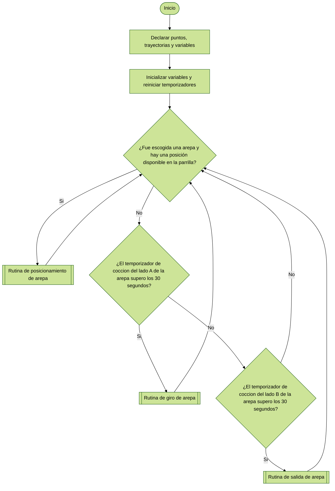
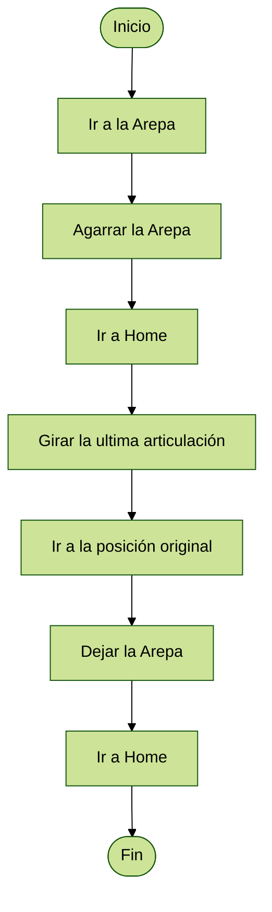
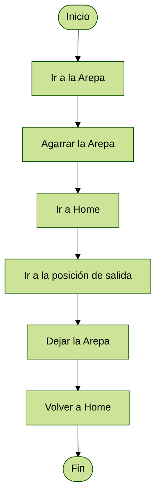

# Proyecto Final - Robótica Industrial: Automatización del Proceso de Preparación de Arepas
Jenny Ximena Ordoñez Espinosa

Juan Felipe Hincapie Gomez

Santiago Zamora Sosa

Stivens Camilo Guevara Moran

## Descripción de la solución planteada  <!--  el proceso de alistamiento, herramientas y piezas utilizadas -->

## Diagrama de Flujo  <!-- descripciones-->
En general, se muestra el planteamiento de la lógica del progrma, que al elegir una arepa la dirige a la posición disponible, considerando el orden (A1, A2, B1, B2). Tras un tiempo gira la arepa y tras otra cantidad de tiempo, retira la arepa de la parrilla.

## Subrutinas
Posicionamiento de la Arepa:

Para el posicionamiento de la arepa en el lugar deseado de la parrilla, el manipulador se dirige a la arepa, la sujeta, la mueve al lugar esperado y la suelta, iniciando un temporizador para el giro de la arepa.

Giro de la Arepa:
Cuando el temporizador supera un limite establecido, el manipulador se dirige a la arepa, la sujeta, realiza un giro en la ultima articulación, y deja la arepa en la posición inicial. Además inicia un temporizador que dara lugar a la subrutina de salida.

Salida de la Arepa:
Al superar el temporizador un tiempo determinado, el manipulador se dirige a la arepa, la sujeta, se dirige a la posición inicial de la arepa en toda la rutina y deja la arepa.

## Gripper Diseñado <!-- Descripci´on, planos y fotograf´ıas-->
Para el diseño del grrpper inicialmente se planteo el problema de dejar la arepa en una posición exacta al momento de voltearla, esto para facilitar la recogida de la arepa una vez haya finalizado la coccion de la arepa en ambos lados. Por ello se diseño un gripper tal que este no tenga un angulo respecto al plano "no" del efector final. Al principio se penso dejar una distancia entre el plano "no" del efector final y la cara inferior del gripper, pero volveriamos a tener el mismo problema, y al moemnto de girar la arepa se tendria que soltar la arepa en el aire, y habria una incertidumbre considerable de la posicion donde cae la arepa. Una vez se discutio y se dejo claro como queriamos realizar el gripper, se procedio a escoger un actuador neumatico de los que habian disponibles en el laboratorio, por lo que se escoguio un actuador neumático de doble efecto de pinzas, esto debido a la facilidad de acoples entre el actuador y el gripper, y su movimiento cumplia perfectamente con nuestra nececidad. Dicho actuador se ve acontinuacion:

## Modelo en Software de Simulación <!-- predeterminado del entorno robótico con todos los elementos que intervienen en el proceso-->

## Comparación del tiempo de alistamiento manual y de operación automatizada para las combinaciones seleccionadas.

## Video

